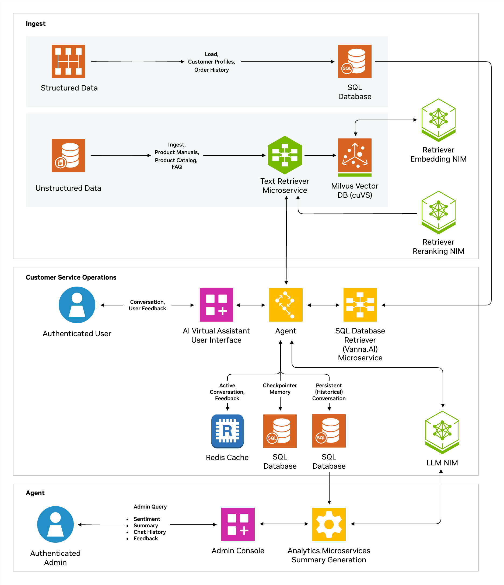

<!--
SPDX-FileCopyrightText: Copyright (c) 2024, NVIDIA CORPORATION & AFFILIATES. All rights reserved.
SPDX-License-Identifier: Apache-2.0

Licensed under the Apache License, Version 2.0 (the "License");
you may not use this file except in compliance with the License.
You may obtain a copy of the License at

http://www.apache.org/licenses/LICENSE-2.0

Unless required by applicable law or agreed to in writing, software
distributed under the License is distributed on an "AS IS" BASIS,
WITHOUT WARRANTIES OR CONDITIONS OF ANY KIND, either express or implied.
See the License for the specific language governing permissions and
limitations under the License.
-->

<h1>NVIDIA AI Blueprint: AI Virtual Assistant for Customer Service with Weights & Biases Weave</h1>

## W&B Weave Integration of the AI Virtual Assistant

<p align="center">

</p>

Weights & Biases has augmented the AI Virtual Assistant Blueprint to give you instant tracing and visibility into the agent,
as well as a platform to iterate on it to bring it to production. The following services have been enabled with W&B Weave:

- Agent
- Unstructured Retriever
- Structured Retriever

This should provide you with the data to be successful in your implementation of this Agent blueprint all the way to production.
The integration is activated when setting `WANDB_API_KEY` when deploying the blueprint in the docker compose or the helm charts (modifying the values file).

NOTE: 
- By default, tracing is logged to your default team in W&B, under project `nv-ai-virtual-assistant`. You can override this by setting `WANDB_PROJECT` as well.
- Milvus is running in GPU mode in the docker compose for the brev launchable performance. To run this locally:
  - change `milvusdb/milvus:v2.4.15-gpu` to `milvusdb/milvus:v2.4.15` in `deploy/compose/docker-compose.yaml` in the milvus section.
  - Remove the section `deploy` under the milvus section.
- Ensure to set `WANDB_API_KEY` and `WANDB_PROJECT` in the values.yaml file for the helm deployment.

This repository has been left largely intact from the source. The documentation below is the original.

## Table of Contents
- [Table of Contents](#table-of-contents)
- [Overview](#overview)
- [Software components](#software-components)
- [Target audience](#target-audience)
- [Prerequisites](#prerequisites)
- [Hardware requirements](#hardware-requirements)
    - [Minimum hardware requirements for self hosting all NIMs](#minimum-hardware-requirements-for-self-hosting-all-nims)
- [API definition](#api-definition)
- [Use case description](#use-case-description)
- [Key Functionality](#key-functionality)
- [How it works](#how-it-works)
  - [Key components](#key-components)
- [Getting started](#getting-started)
  - [Docker compose](#docker-compose)
    - [System requirements](#system-requirements)
    - [Install software requirements](#install-software-requirements)
    - [Obtain API keys](#obtain-api-keys)
    - [Set up the blueprint repository](#set-up-the-blueprint-repository)
    - [Set up the environment file](#set-up-the-environment-file)
    - [Authenticate Docker with NGC](#authenticate-docker-with-ngc)
    - [Build the Docker containers](#build-the-docker-containers)
    - [Start the Docker containers](#start-the-docker-containers)
    - [Data Ingestion](#data-ingestion)
    - [Front End (UI)](#front-end-ui)
    - [Standalone APIs](#standalone-apis)
    - [Stopping the services](#stopping-the-services)
- [Customizing the blueprint](#customizing-the-blueprint)
- [Data flywheel](#data-flywheel)
- [Helm chart deployment](#helm-chart-deployment)
    - [Minimum hardware requirements](#minimum-hardware-requirements)
    - [Prerequisites](#prerequisites-1)
    - [Initialize environment variables](#initialize-environment-variables)
    - [Helm deployment](#helm-deployment)
    - [Interacting with UI service](#interacting-with-ui-service)
- [Troubleshooting](#troubleshooting)
  - [Container build issues](#container-build-issues)
    - [Device error](#device-error)
    - [Deploy.Resources.Reservations.devices error](#deployresourcesreservationsdevices-error)
    - [Resetting the entire cache](#resetting-the-entire-cache)
  - [Vector databases](#vector-databases)
  - [Running out of credits](#running-out-of-credits)
  - [Password Issue Fix](#password-issue-fix)
- [Known issues](#known-issues)
- [Inviting the community to contribute](#inviting-the-community-to-contribute)
- [License](#license)

## Overview
This repository is what powers the [build experience](https://build.nvidia.com/nvidia/ai-virtual-assistant-for-customer-service), showcasing an AI virtual assistant with NVIDIA NIM microservices (https://build.nvidia.com/nim)

This blueprint is a reference solution for a text based virtual assistant. With the rise of generative AI, companies are eager to enhance their customer service operations by integrating knowledge bases that are close to sensitive customer data. Traditional solutions often fall short in delivering context-aware, secure, and real-time responses to complex customer queries. This leads to longer resolution times, limited customer satisfaction, and potential data exposure risks. A centralized knowledge base that integrates seamlessly with internal applications and call center tools is vital to improving customer experience while ensuring data governance.
The AI virtual assistant for customer service NIM Agent Blueprint, powered by NVIDIA NeMo Retriever™ and NVIDIA NIM™ microservices, along with retrieval-augmented generation (RAG), offers a streamlined solution for enhancing customer support. It enables context-aware, multi-turn conversations, providing general and personalized Q&A responses based on structured and unstructured data, such as order history and product details.

## Software components

* NVIDIA NIM microservices
   * Response Generation (Inference)
      * [NIM of meta/llama-3.1-70b-instruct](https://build.nvidia.com/meta/llama-3_1-70b-instruct)
      * [NIM of nvidia/nv-embedqa-e5-v5](https://build.nvidia.com/nvidia/nv-embedqa-e5-v5)
      * [NIM of nvidia/rerank-qa-mistral-4b](https://build.nvidia.com/nvidia/rerank-qa-mistral-4b)
   * [Synthetic Data Generation](./notebooks/synthetic_data_generation.ipynb) for reference
      * [NIM of Nemotron4-340B](nvidia/nemotron-4-340b-instruct)
* Orchestrator Agent - LangGraph based
* Text Retrievers - LangChain
* Structured Data (CSV) Ingestion - Postgres Database
* Unstructured Data (PDF) Ingestion - Milvus Database (Vector GPU-optimized)

Docker Compose scripts are provided which spin up the microservices on a single node. When ready for a larger-scale deployment, you can use the included Helm charts to spin up the necessary microservices. You will use sample Jupyter notebooks with the JupyterLab service to interact with the code directly.

The Blueprint contains sample use-case data pertaining to retail product catalog and customer data with purchase history but Developers can build upon this blueprint, by customizing the RAG application to their specific use case.  A sample customer service agent user interface and API-based analytic server for conversation summary and sentiment are also included.


## Target audience
This blueprint is for:
- **IT engineers**: Engineers wanting a quickstart to using NVIDIA NIMs in an agentic solution for a virtual assistant.

## Prerequisites
- NVAIE developer licence
- API keys for LLM model service(s).
  - Details can be found in this later section: [Obtain API keys](#obtain-api-keys)

## Hardware requirements
Below are the hardware requirements for each component.
The reference code in the solution (glue code) is referred to as as the "pipeline".

The overall hardware requirements depend on the selected deployment. The NIM and hardware requirements only need to be met if you are self-hosting them. See [Using self-hosted NIMs](#using-self-hosted-nims)

#### Minimum hardware requirements for self hosting all NIMs
8XH100, 8XA100

- **Pipeline operation**: 1x L40 GPU or similar recommended. It is needed for vectorstore milvus.
- (If locally deployed) **LLM NIM**: [Meta Llama 3.1 70B Instruct Support Matrix](https://docs.nvidia.com/nim/large-language-models/latest/support-matrix.html#llama-3-1-70b-instruct)
  - For improved paralleled performance, we recommend 8x or more H100s for LLM inference.
  - The pipeline can share the GPU with the LLM NIM, but it is recommended to have a separate GPU for the LLM NIM for optimal performance.
- (If locally deployed) **Embedding NIM**: [NV-EmbedQA-E5-v5 Support Matrix](https://docs.nvidia.com/nim/nemo-retriever/text-embedding/latest/support-matrix.html#nv-embedqa-e5-v5)
  - The pipeline can share the GPU with the Embedding NIM, but it is recommended to have a separate GPU for the Embedding NIM for optimal performance.
- (If locally deployed) **Reranker NIM**: [NV-RerankQA-Mistral4B-v3 Support Matrix](https://docs.nvidia.com/nim/nemo-retriever/text-reranking/latest/support-matrix.html#nv-rerankqa-mistral4b-v3)

## API definition

[OpenAPI Specification](./docs/api_references)

## Use case description

**First-Party Customer Service Bot**
Build a virtual assistant that directly represents your organization’s brand. This AI-powered bot can greet customers on your website or mobile app, respond to their inquiries, and guide them through common issues—like finding product information, troubleshooting, or processing returns. It leverages your company’s own structured data (e.g., customer accounts, order histories) and unstructured data (e.g., product manuals, FAQs) to deliver quick, context-aware answers, reducing response times and improving overall customer satisfaction.

**Extending an Existing Bot**
Enhance your current chatbot or virtual assistant by integrating advanced AI capabilities. The solution can serve as a layer on top of your existing system, enabling it to handle more complex queries, understand the user’s full context, and provide richer, more detailed responses. With retrieval-augmented generation, the extended bot can pull from a broader range of internal documentation, external articles, or product data. It can also incorporate sentiment analysis and summarization features, helping your existing bot become more responsive, empathetic, and effective in resolving customer inquiries.

## Key Functionality

* Personalized Responses: Handles structured and unstructured customer queries (e.g., order details, spending history).
* Multi-Turn Dialogue: Offers context-aware, seamless interactions across multiple questions.
* Custom Conversation Style: Adapts text responses to reflect corporate branding and tone.
* Sentiment Analysis: Analyzes real-time customer interactions to gauge sentiment and adjust responses.
* Multi-Session Support: Allows for multiple user sessions with conversation history and summaries.
* Data Privacy: Integrates with on-premises or cloud-hosted knowledge bases to protect sensitive data.

By integrating NVIDIA NIM and RAG, the system empowers developers to build customer support solutions that can provide faster and more accurate support while maintaining data privacy.

## How it works
This blueprint uses a combination of retrieval-augmented generation and large language models to deliver an intelligent, context-aware virtual assistant for customer service. It connects to both structured data (like customer profiles and order histories) and unstructured data (like product manuals, FAQs) so that it can find and present relevant information in real time.

The process works as follows:

* User Query: The customer asks a question in natural language.
* Data Retrieval: The system retrieves relevant data—such as support documents or order details—by embedding and searching through internal databases, product manuals, and FAQs.
* Contextual Reasoning: A large language model uses these retrieved details to generate a helpful, coherent, and contextually appropriate response.
* Additional Capabilities: Tools like sentiment analysis gauge the user’s satisfaction and conversation summaries help supervisors quickly review interactions.
* Continuous Improvement: Feedback from interactions is fed back into the system, refining the model’s accuracy and efficiency over time.
The end result is a virtual assistant that can understand complex questions, find the right information, and provide personalized, human-like responses.

### Key components
The detailed architecture consists of the following components:

<p align="center">

</p>

**Sample Data**
The blueprint comes with synthetic sample data representing a typical customer service function, including customer profiles, order histories (structured data), and technical product manuals (unstructured data). A notebook is provided to guide users on how to ingest both structured and unstructured data efficiently.

Structured Data: Includes customer profiles and order history
Unstructured Data: Ingests product manuals, product catalogs, and FAQs

**AI Agent**
This reference solution implements three sub-agents using the open-source LangGraph framework. These sub-agents address common customer service tasks for the included sample dataset. They rely on the Llama 3.1 model 70B and NVIDIA NIM microservices for generating responses, converting natural language into SQL queries, and assessing the sentiment of the conversation.

**Structured Data Retriever**
Works in tandem with a Postgres database and Vanna.AI to fetch relevant data based on user queries.

**Unstructured Data Retriever**
Processes unstructured data (e.g., PDFs, FAQs) by chunking it, creating embeddings using the NeMo Retriever embedding NIM, and storing it in Milvus for fast retrieval.

**Analytics and Admin Operations**
To support operational requirements, the blueprint includes reference code for managing key administrative tasks:

- Storing conversation histories
- Generating conversation summaries
- Conducting sentiment analysis on customer interactions
These features ensure that customer service teams can efficiently monitor and evaluate interactions for quality and performance.

**Data Flywheel**
The blueprint includes a robust set of APIs, some of which are explicitly designed for feedback collection (identified by 'feedback' in their URLs). These APIs support the process of gathering data for continuous model improvement, forming a feedback loop or 'data flywheel.' While this process enables refinement of the model's performance over time to improve accuracy and cost-effectiveness, it is important to note that they do not directly perform the model fine-tuning itself.

**Summary**
In summary, this NVIDIA NIM Agent Blueprint offers a comprehensive solution for building intelligent, generative AI-powered virtual assistants for customer service, leveraging structured and unstructured data to deliver personalized and efficient support. It includes all necessary tools and guidance to deploy, monitor, and continually improve the solution in real-world environments.

## Getting started
There are two deployment methods
1. Docker compose (for a single node deployment)
2. Helm chart (to deploy on a kubernetes cluster)

### Docker compose
#### System requirements
Ubuntu 20.04 or 22.04 based machine, with sudo privileges

#### Install software requirements
- Install Docker Engine and Docker Compose. Refer to the instructions for [Ubuntu](https://docs.docker.com/engine/install/ubuntu/).
- Ensure the Docker Compose plugin version is 2.29.1 or higher.
- Run docker compose version to confirm.
- Refer to [Install the Compose plugin](https://docs.docker.com/compose/install/linux/) in the Docker documentation for more information.
- To configure Docker for GPU-accelerated containers, install the [NVIDIA Container Toolkit](https://docs.nvidia.com/datacenter/cloud-native/container-toolkit/latest/install-guide.html).
- Install [git](https://git-scm.com/)

By default the provided configurations use GPU optimized databases such as Milvus.

#### Obtain API keys
To run the pipeline you need to obtain API keys for the following APIs. These will be needed in a later step to [Set up the environment file](#set-up-the-environment-file).

- **Required API Keys**: These APIs are required by the pipeline to execute LLM queries.
  - NVIDIA Inference Microservices (NIM)
    - There are two possible methods to generate an API key for NIM:
      - Sign in to the [NVIDIA Build](https://build.nvidia.com/explore/discover?signin=true) portal with your email.
        - Click on any [model](https://build.nvidia.com/meta/llama-3_1-70b-instruct), then click "Get API Key", and finally click "Generate Key".
      - Sign in to the [NVIDIA NGC](https://ngc.nvidia.com/) portal with your email.
        - Select your organization from the dropdown menu after logging in. You must select an organization which has NVIDIA AI Enterprise (NVAIE) enabled.
        - Click on your account in the top right, select "Setup" from the dropdown.
        - Click the "Generate Personal Key" option and then the "+ Generate Personal Key" button to create your API key.
          - This will be used in the `NVIDIA_API_KEY` environment variable.
        - Click the "Generate API Key" option and then the "+ Generate API Key" button to create the API key.
          - This will be used in the `NGC_API_KEY` environment variable.

  NOTE: The personal key generated using the "Generate Personal Key" option can be used as both `NGC_API_KEY` and `NVIDIA_API_KEY`. Ensure that `NGC Catalog` and `Cloud Functions` are selected from the `Services Included` dropdown.

#### Set up the blueprint repository

Clone the repository and set an environment variable for the path to the repository root.

```bash
export REPO_ROOT=$(git rev-parse --show-toplevel)
```

All commands are run from the repository root unless otherwise specified.

#### Set up the environment file

First we need to create an `.env` file in the `REPO_ROOT`, and add the API keys you created in the earlier [Obtain API keys](#obtain-api-keys) step.

```bash
cd $REPO_ROOT
cat <<EOF > .env
NVIDIA_API_KEY="your NVIDIA Inference Microservices API key"
NGC_API_KEY="your NGC API key"
EOF
```

These variables need to be exported to the environment:
```bash
export $(cat .env | xargs)
```

#### Authenticate Docker with NGC

In order to pull images required by the blueprint from NGC, you must first authenticate Docker with NGC. You can use NGC API Key obtained in the [Obtain API keys](#obtain-api-keys) section (saved as `NGC_API_KEY` in the `.env` file).

```bash
echo "${NGC_API_KEY}" | docker login nvcr.io -u '$oauthtoken' --password-stdin
```

#### Build the Docker containers
Refer to [Starting the Docker containers](#start-the-docker-containers), where the `docker compose -f deploy/compose/docker-compose.yaml up -d` step will build the containers the first time it is run.

If any customizations are made to the source code, we will need to build the respective container from source using the following command:
```bash
cd $REPO_ROOT

# Build the containers
docker compose -f deploy/compose/docker-compose.yaml build <container name>
```
The container name can be determined from the docker-compose file.

#### Start the Docker containers

There are two supported configurations for starting the Docker containers.
The default passwords in [docker-compose.yaml](./deploy/compose/docker-compose.yaml) and the source code (e.g. default DB passwords) should be changed before deploying the blueprint.

1. [**NVIDIA-hosted NIMs**](#using-nvidia-hosted-nims): The blueprint is run with all computation being performed by NIMs hosted in NVIDIA GPU Cloud. This is the default configuration and is **recommended** for most users getting started with the blueprint.
```bash
cd $REPO_ROOT
docker compose -f deploy/compose/docker-compose.yaml up -d
docker ps --format "table {{.ID}}\t{{.Names}}\t{{.Status}}"
CONTAINER ID   NAMES                       STATUS
766f8269b946   agent-frontend              Up 3 hours
b6a1853c4e81   agent-chain-server          Up 3 hours
91487a937be1   analytics-server            Up 3 hours
0112183489fe   unstructured-retriever      Up 3 hours
9970bb569dbd   structured-retriever        Up 3 hours
4ea1a3267a17   milvus-standalone           Up 3 hours
c988dcdd67c3   postgres_container          Up 3 hours (healthy)
3dc1c2262903   milvus-minio                Up 3 hours (healthy)
eee52b7302fb   milvus-etcd                 Up 3 hours (healthy)
907f5702f82b   compose-redis-1             Up 3 hours
fcde431d44de   pgadmin_container           Up 3 hours
f2ce39cf3027   compose-redis-commander-1   Up 3 hours (healthy)
```

2. [**Self-hosted NIMs**](#using-self-hosted-nims): The blueprint is run using self-hosted LLM NIM services.

```bash
# Create model directory to download model from NGC
 mkdir -p ~/.cache/models
 export MODEL_DIRECTORY=~/.cache/models/

 # export your ngc api key, note it's not nvidia_api_key from build.nvidia.com
 export NGC_API_KEY=<ngc-api-key>
 export USERID="$(id -u):$(id -g)"

 # Export path where NIMs are hosted
 # LLM server path
 export APP_LLM_SERVERURL=nemollm-inference:8000
 # Embedding server path
 export APP_EMBEDDINGS_SERVERURL=nemollm-embedding:8000
 # Re-ranking model path
 export APP_RANKING_SERVERURL=ranking-ms:8000


 docker compose -f deploy/compose/docker-compose.yaml --profile local-nim up -d

```
On successful deployment, you should see these containers running. It may take approximately 10 minutes to download and deploy the models for the first time.
```bash
docker ps --format "table {{.ID}}\t{{.Names}}\t{{.Status}}"
CONTAINER ID   NAMES                                   STATUS
1dd42caad60e   agent-chain-server                      Up 55 minutes
4c4d1136cd7a   structured-retriever                    Up 3 hours
ff2f71eb9d75   unstructured-retriever                  Up 3 hours
fd70635efcac   analytics-server                        Up 3 hours
8fc99cf27945   nemo-retriever-ranking-microservice     Up 3 hours (healthy)
d3853cc6b622   nemo-retriever-embedding-microservice   Up 3 hours (healthy)
dcc22f20df1f   nemollm-inference-microservice          Up 3 hours (healthy)
b4cfafffa57b   milvus-standalone                       Up 3 hours
dfdaa5ff59be   postgres_container                      Up 3 hours (healthy)
8787645d8b4f   milvus-minio                            Up 3 hours (healthy)
caa2e19b030b   pgadmin_container                       Up 3 hours
77b4fb45d600   milvus-etcd                             Up 3 hours (healthy)
5be79d19281e   compose-redis-1                         Up 3 hours
6a5353baa2d1   compose-redis-commander-1               Up 3 hours (healthy)
```
[!TIP]: To change the GPUs used for NIM deployment, set the following environment variables before triggering the docker compose:
```bash
LLM_MS_GPU_ID: Update this to specify the LLM GPU IDs (e.g., 0,1,2,3).
EMBEDDING_MS_GPU_ID: Change this to set the embedding GPU ID.
RANKING_MS_GPU_ID: Modify this to adjust the reranking LLM GPU ID.
RANKING_MS_GPU_ID: Modify this to adjust the reranking LLM GPU ID.
VECTORSTORE_GPU_DEVICE_ID : Modify to adjust the Milvus vector database GPU ID.
```

#### Data Ingestion

Download the manuals into data/manuals_pdf folder
**Run this script to download the manuals listed in the specified txt file**
```bash
cd $REPO_ROOT
./data/download.sh ./data/list_manuals.txt
```
**Install jupyterlab**

```bash
pip install jupyterlab
```

**Use this command to run Jupyter Lab so that you can execute this IPython notebook**
```bash
jupyter lab --allow-root --ip=0.0.0.0 --NotebookApp.token='' --port=8889
```

**Execute the ingest_data.ipynb notebook**

Follow the cells in the notebook ingest_data.ipynb to do the following
- Unstructured Data (PDF) Ingestion to Milvus DB
- Structured Data (CSV) Ingestion to Postgres DB

#### Front End (UI)

A sample frontend is available to showcase key (but not all) functionalities of this blueprint.
The source code of this service is not inlcuded in the blueprint. It is expected that you will use this for a quick test before proceeding to customize the blueprint and use the APIs as part of your differentiating Generative AI application.

The UI microservice is already included in the Docker Compose setup. Visit `http://<HOST-IP>:3001/` to access the frontend and test the suggested queries. You can also refer to the data to create meaningful queries.
You can choose any of the preset customer names and ask queries relevant to order history displayed or relevant to any ingested unstructured data.

Click `End Chat Session` button once you have finished your conversation.

The sample UI showcases limited number of functionalities and interacts with a single API endpoint exposed by the [API Gateway container](./docs/api_references/api_gateway_server.json).

#### Standalone APIs

We expect you to use these APIs to integrate the blueprint with your Generative AI applications
For detailed API references of all the key deployed microservices, please refer to the following:

- [Analytics Microservice](.docs/api_references/analytics_server.json)
- [Agent Microservice](./docs/api_references/agent_server.json)
- [Retriever Microservices](./docs/api_references/retriever_server.json)

The notebooks folder [api_usage.ipynb](./notebooks/api_usage.ipynb) illustrates how to use the Agent and the Analytics APIs along with how to extract the user feedback data.

#### Stopping the services

If you have deployed the default configuration (i.e. NVIDIA deployed NIMs), the command below suffices.
```bash
cd $REPO_ROOT
docker compose -f deploy/compose/docker-compose.yaml down
```
If you have locally deployed NIMs, you would need an extra flag thus
```bash
cd $REPO_ROOT
docker compose -f deploy/compose/docker-compose.yaml --profile local-nim down
```

## Customizing the blueprint

The blueprint is a reference example with sample data illustrating how a customer can create an entire solution with NVIDIA NIMs. However it is completely expected that customers will tear apart the solution to pick out what is meaningful in any capacity.
Here are some notes as you customize the blueprint

- * The prompts have been tuned to work best with the Llama 3.1 70B NIM and that when using other LLM models it may be necessary to adjust the prompting.
- * The docker-compose and helm chart configuration files have the default variable settings that can be over ridden. Two configurations (locally deployed NIMs and NVIDIA hosted NIMs) are accounted for but you can adjust the other variables as you see fit.
- * When bringing your own customer data such as your order history etc. you would need to modify the source code with the relevant [prompts](./src/agent/prompt.yaml).

## Data flywheel

It is anticipated that Generative AI applications typically begin with deploying the default/out of the box LLM models(NIMs) The blueprint enables the ability to collect feedback at various places in the solution. These include
* user feedback for every answer generated
* user feedback for the overall conversation
* feedback for the generated summary
* feedback for assessed user sentiment

It can be envisioned that some feedback is provided by the user conversing with the virtual assistant and some feedback will be provided by the customer services operations' team.
The feedback scores follow this convention

- Postive indicated by +1
- Neutral indicated by 0
- Negative indicated by -1

Sample code for retrieving the feedback data is in the notebook included [here](./notebooks).

## Helm chart deployment
#### Minimum hardware requirements
The host need to have atleast `8xH100` or `8xA100` GPUs for deploying the chart including the 3 NVIDIA NIMs.

#### Prerequisites

- You have the NGC CLI available on your client machine.
  You can download the CLI from <https://ngc.nvidia.com/setup/installers/cli>.

- You have Kubernetes installed and running Ubuntu 22.04.
  Refer to the [Kubernetes documentation](https://kubernetes.io/docs/setup/) or
  the [NVIDIA Cloud Native Stack repository](https://github.com/NVIDIA/cloud-native-stack/)
  for more information.

- You have a default storage class available in the cluster for PVC provisioning.
  One option is the local path provisioner by Rancher.
  Refer to the [installation](https://github.com/rancher/local-path-provisioner?tab=readme-ov-file#installation)
  section of the README in the GitHub repository.

  ```console
  kubectl apply -f https://raw.githubusercontent.com/rancher/local-path-provisioner/v0.0.26/deploy/local-path-storage.yaml
  kubectl get pods -n local-path-storage
  kubectl get storageclass
  ```

- If the local path storage class is not set as default, it can be made default using the command below
  ```
  kubectl patch storageclass local-path -p '{"metadata": {"annotations":{"storageclass.kubernetes.io/is-default-class":"true"}}}'
  ```

- You have installed the NVIDIA GPU Operator following steps [here](https://docs.nvidia.com/datacenter/cloud-native/gpu-operator/latest/getting-started.html)

- You have a `NGC_API_KEY`. Check the [Obtain API keys](#obtain-api-keys) section for steps to obtain this key.

#### Initialize environment variables
Export your NGC_API_KEY
```bash
export NGC_API_KEY=<>
```
#### Helm deployment
Create a docker registry secret for the above NGC API Key.
```bash
kubectl create secret docker-registry ngc-docker-reg-secret --docker-server=nvcr.io --docker-username='$oauthtoken' --docker-password=$NGC_API_KEY
```

Create a generic secret for NGC_API_KEY
```bash
kubectl create secret generic ngc-secret --from-literal=ngc-api-key=$NGC_API_KEY
```

run the deploy.sh script
```bash
cd deploy/helm/
bash deploy.sh
```
Upon a successfull deploymemt, all the following pods should be in a ready and running state.

```bash
kubectl get pods

NAME                                                          READY   STATUS    RESTARTS   AGE
agent-services-agent-services-deployment-7fc64755fc-6zk6h     1/1     Running   0          15m
analytics-services-analytics-deployment-7f4fd96c8b-hxngk      1/1     Running   0          15m
api-gateway-api-gateway-deployment-75865f4b4d-9rttq           1/1     Running   0          15m
cache-services-cache-services-deployment-796dd6b8b7-rd24l     2/2     Running   0          15m
etcd-etcd-deployment-59c9c5c9b4-bxhpd                         1/1     Running   0          15m
ingest-client-ingest-client-deployment-6cdd6d9b5c-fswwf       1/1     Running   0          15m
milvus-milvus-deployment-75c84d88b7-rs6r7                     1/1     Running   0          15m
minio-minio-deployment-669bf8d58d-dnld2                       1/1     Running   0          15m
nemollm-embedding-embedding-deployment-6bdc968784-9v2mm       1/1     Running   0          15m
nemollm-inference-nemollm-infer-deployment-5b88bf7bc-cmxsz    1/1     Running   0          15m
pgadmin-pgadmin-deployment-595846d766-spps2                   1/1     Running   0          15m
postgres-postgres-deployment-96944cc48-96rz5                  1/1     Running   0          15m
ranking-ms-ranking-deployment-5c7768d88b-zvtt5                1/1     Running   0          15m
retriever-canonical-canonical-deployment-9754b58fb-p6rbd      1/1     Running   0          15m
retriever-structured-structured-deployment-6d744d6957-dh7sj   1/1     Running   0          15m
aiva-aiva-ui-ff74b47d7-r27pb                                  1/1     Running   0          15m
```

#### Interacting with UI service
The UI service exposes a nodePort using which we can access the UI

List the services
```bash
kubectl get svc
```

The output of the command should list out the following services
```
NAME                                                              TYPE           EXTERNAL-IP   PORT(S)              AGE
agent-services-agent-services-deployment-agent-service            ClusterIP      <none>        8081/TCP             31m
aiva-aiva-ui                                                      NodePort       <none>        3001:32417/TCP       31m
analytics-services-analytics-deployment-analytics-service         ClusterIP      <none>        8082/TCP             31m
api-gateway-api-gateway-deployment-api-gateway-service            ClusterIP      <none>        9000/TCP             31m
cache-services-cache-services-deployment-cache-services-service   ClusterIP      <none>        6379/TCP,9092/TCP    31m
etcd-etcd-deployment-etcd-service                                 ClusterIP      <none>        2379/TCP             31m
ingest-client-ingest-client-deployment-ingest-client-service      ClusterIP      <none>        9001/TCP             31m
kubernetes                                                        ClusterIP      <none>        443/TCP              103d
milvus-milvus-deployment-milvus-service                           ClusterIP      <none>        19530/TCP,9091/TCP   31m
minio-minio-deployment-minio-service                              ClusterIP      <none>        9011/TCP,9010/TCP    31m
nemollm-embedding-embedding-deployment-embedding-service          ClusterIP      <none>        9080/TCP             31m
nemollm-inference-nemollm-infer-deployment-llm-service            ClusterIP      <none>        8000/TCP             31m
pgadmin-pgadmin-deployment-pgadmin-service                        ClusterIP      <none>        5050/TCP             31m
postgres-postgres-deployment-postgres-service                     ClusterIP      <none>        5432/TCP             31m
ranking-ms-ranking-deployment-ranking-service                     ClusterIP      <none>        1976/TCP             31m
retriever-canonical-canonical-deployment-canonical-service        ClusterIP      <none>        8086/TCP             31m
retriever-structured-structured-deployment-structured-service     ClusterIP      <none>        8087/TCP             31m
```

Look for the UI service `aiva-aiva-ui`, the port type is listed as NodePort.
The NodePort is the one that follows the container port`3001:<nodePort>/TCP`

In this example case, the node port is listed as `32417`, hence the UI can be accessed at http://0.0.0.0:32417/

## Troubleshooting
### Container build issues

When building containers for self-hosted NIMs, certain issues may occur. Below are common troubleshooting steps to help resolve them.

#### Device error

If you encounter an error resembling the following during the [container build process for self-hosted NIMs](#using-self-hosted-nims):

```bash
nvidia-container-cli: device error: {n}: unknown device: unknown
```

This error typically indicates that the container is attempting to access GPUs that are either unavailable or non-existent on the host. To resolve this, verify the GPU count specified in the [nims.yaml](./deploy/compose/nims.yaml) configuration file:

#### Deploy.Resources.Reservations.devices error

If you encounter an error resembling the following during the [container build process for self-hosted NIMs](#using-self-hosted-nims) process:
```
1 error(s) decoding:

* error decoding 'Deploy.Resources.Reservations.devices[0]': invalid string value for 'count' (the only value allowed is 'all')
```

This is likely caused by an [outdated Docker Compose version](https://github.com/docker/compose/issues/11097). Please upgrade Docker Compose to at least `v2.29.0`.

#### Resetting the entire cache

To reset the entire cache, you can run the following command:
```bash
docker compose down -v
```
This will delete all the volumes associated with the containers, including the cache.

### Vector databases
We've integrated VDB and embedding creation directly into the pipeline with caching included for expediency. However, in a production environment, it's better to use a separately managed VDB service.

NVIDIA offers optimized models and tools like NIMs ([build.nvidia.com/explore/retrieval](https://build.nvidia.com/explore/retrieval)) and cuVS ([github.com/rapidsai/cuvs](https://github.com/rapidsai/cuvs)).

### Running out of credits

If you run out of credits for the NVIDIA API Catalog, you will need to obtain more credits to continue using the API. Please contact your NVIDIA representative to get more credits added.

### Password Issue Fix

If you encounter any "password authentication failed" issues with the structured retriever container, consider removing the volumes directory located at deploy/compose/volumes. Please note that in this case, you may need to reprocess the data ingestion.

## Known issues
- The Blueprint responses can have significant latency when using [NVIDIA API Catalog cloud hosted models.](#option-1-deploy-with-nvidia-hosted-endpoints)

## Inviting the community to contribute
We're posting these examples on GitHub to support the NVIDIA LLM community and facilitate feedback. We invite contributions! Open a GitHub issue or pull request! See contributing [guidelines here.](./CONTRIBUTING.md)

## License
This NVIDIA NIM-AGENT BLUEPRINT is licensed under the [Apache License, Version 2.0.](./LICENSE.md)
Use of the sample data provided as part of this blueprint is governed by [the NVIDIA asset license.](./data/LICENSE)
