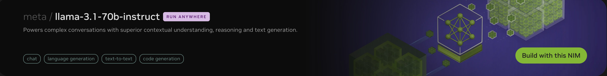
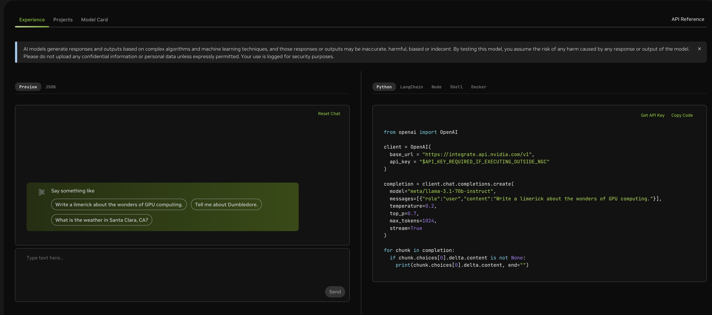

# Docker deployment guide
- [Docker deployment guide](#docker-deployment-guide)
    - [1. Prerequisites](#1-prerequisites)
      - [Software requirements](#software-requirements)
      - [Get an NVIDIA API Catalog key](#get-an-nvidia-api-catalog-key)
      - [Get an NVIDIA NGC API Key](#get-an-nvidia-ngc-api-key)
    - [2. Start the required microservices](#2-start-the-required-microservices)
      - [Deploy with cloud hosted models](#deploy-with-cloud-hosted-models)
      - [Deploy with on-prem models](#deploy-with-on-prem-models)
    - [3. Data Ingestion](#3-data-ingestion)
    - [4. Testing](#4-testing)
      - [Using sample frontend](#using-sample-frontend)
      - [Using standalone API's](#using-standalone-apis)
    - [5. API References](#5-api-references)
    - [6. Stopping Services](#6-stopping-services)
    - [7. Customizing GPUs for on-prem NIM Deployment](#7-customizing-gpus-for-on-prem-nim-deployment)

### 1. Prerequisites

#### Software requirements
- Install Docker Engine and Docker Compose.
  Refer to the instructions for [Ubuntu](https://docs.docker.com/engine/install/ubuntu/).

  Ensure the Docker Compose plugin version is 2.29.1 or higher.
  Run `docker compose version` to confirm.
  Refer to [Install the Compose plugin](https://docs.docker.com/compose/install/linux/)
  in the Docker documentation for more information.

- Optional: You can run some containers with GPU acceleration, such as Milvus and NVIDIA NIM for LLMs.
  To configure Docker for GPU-accelerated containers, [install](https://docs.nvidia.com/datacenter/cloud-native/container-toolkit/latest/install-guide.html) the NVIDIA Container Toolkit.


#### Get an NVIDIA API Catalog key

This step can be skipped if you are interested in [deploying the models on-prem.](#deploy-with-on-prem-models)
This key will be used to access cloud hosted models in [API Catalog](https://build.nvidia.com/explore/discover).
You can use different model API endpoints with the same API key.

1. Navigate to <https://build.nvidia.com/explore/discover>.

2. Find the **Llama 3.1 70B Instruct** card and click the card.
   

3. Click **Get API Key**.
   

4. Click **Generate Key**.

   

5. Click **Copy Key** and then save the API key.
   The key begins with the letters nvapi-.

   

6. Export NVIDIA_API_KEY
   ```
   export NVIDIA_API_KEY="give your NVIDIA api key"
   ```


#### Get an NVIDIA NGC API Key

The NVIDIA NGC API Key is a mandatory key that is required to use this blueprint. This is needed to log into the NVIDIA container registry, `nvcr.io`, and to pull secure container images used in this NVIDIA NIM Blueprint.

Refer to [Generating NGC API Keys](https://docs.nvidia.com/ngc/gpu-cloud/ngc-user-guide/index.html#generating-api-key)
in the _NVIDIA NGC User Guide_ for more information.

After you get your NGC API key, run `docker login nvcr.io` and provide the credentials.


### 2. Start the required microservices

#### Deploy with cloud hosted models


   `docker compose -f deploy/compose/docker-compose.yaml up -d`


On deployment following containers should be up and running

    ```
    $ docker ps --format "table {{.ID}}\t{{.Names}}\t{{.Status}}"
    CONTAINER ID   NAMES                       STATUS
    b6a1853c4e81   agent-chain-server          Up 3 hours
    91487a937be1   analytics-server            Up 3 hours
    0112183489fe   unstructured-retriever      Up 3 hours
    9970bb569dbd   structured-retriever        Up 3 hours
    4ea1a3267a17   milvus-standalone           Up 3 hours
    c988dcdd67c3   postgres_container          Up 3 hours (healthy)
    3dc1c2262903   milvus-minio                Up 3 hours (healthy)
    eee52b7302fb   milvus-etcd                 Up 3 hours (healthy)
    907f5702f82b   compose-redis-1             Up 3 hours
    fcde431d44de   pgadmin_container           Up 3 hours
    f2ce39cf3027   compose-redis-commander-1   Up 3 hours (healthy)
    ```
#### Deploy with on-prem models

   ```
    # Create model directory to download model from NGC
    mkdir -p ~/.cache/models
    export MODEL_DIRECTORY=~/.cache/models/

    # export your ngc api key, note it's not nvidia_api_key from build.nvidia.com
    export NGC_API_KEY=<ngc-api-key>
    export USERID="$(id -u):$(id -g)"

    # Export path where NIMs are hosted
    # LLM server path
    export APP_LLM_SERVERURL=nemollm-inference:8000
    # Embedding server path
    export APP_EMBEDDINGS_SERVERURL=nemollm-embedding:8000
    # Re-ranking model path
    export APP_RANKING_SERVERURL=ranking-ms:8000

    docker compose -f deploy/compose/docker-compose.yaml --profile local-nim up -d
   ```


On deployment following containers should be up and running

    ```
    $ docker ps --format "table {{.ID}}\t{{.Names}}\t{{.Status}}"
    CONTAINER ID   NAMES                                   STATUS
    1dd42caad60e   agent-chain-server                      Up 55 minutes
    4c4d1136cd7a   structured-retriever                    Up 3 hours
    ff2f71eb9d75   unstructured-retriever                  Up 3 hours
    fd70635efcac   analytics-server                        Up 3 hours
    8fc99cf27945   nemo-retriever-ranking-microservice     Up 3 hours (healthy)
    d3853cc6b622   nemo-retriever-embedding-microservice   Up 3 hours (healthy)
    dcc22f20df1f   nemollm-inference-microservice          Up 3 hours (healthy)
    b4cfafffa57b   milvus-standalone                       Up 3 hours
    dfdaa5ff59be   postgres_container                      Up 3 hours (healthy)
    8787645d8b4f   milvus-minio                            Up 3 hours (healthy)
    caa2e19b030b   pgadmin_container                       Up 3 hours
    77b4fb45d600   milvus-etcd                             Up 3 hours (healthy)
    5be79d19281e   compose-redis-1                         Up 3 hours
    6a5353baa2d1   compose-redis-commander-1               Up 3 hours (healthy)
    ```

Note:

   - By default, GPU IDs 0-3 are for LLM, 4 for the embedding model, and 5 for the reranking model; see [Customizing GPU](#customizing-gpus-for-nim-deployment) for changes.

   - The above command pulls in the prebuilt containers from NGC and deploys it locally. If you have made changes locally or you are interested in building the container from source code, append `--build` argument to the above commands. For example to deploy the pipeline locally using cloud hosted models and containers build from source use:

      `docker compose -f deploy/compose/docker-compose.yaml up -d --build`

### 3. Data Ingestion

Download the manuals into `data/manuals_pdf` folder
```
# Run this script to download the manuals listed in the specified txt file
./data/download.sh ./data/list_manuals.txt
```

Install jupyterlab
```
pip install jupyterlab
```

Run the jupyterlab server
```
# Use this command to run Jupyter Lab so that you can execute this IPython notebook.
jupyter lab --allow-root --ip=0.0.0.0 --NotebookApp.token='' --port=8889
```

Follow the cells in the notebook ingest_data.ipynb to do the following

1. Unstructured Data (PDF) Ingestion to Milvus DB
2. Structured Data (CSV) Ingestion to Postgres DB

### 4. Testing

#### Using sample frontend
A sample frontend is available to showcase key functionalities of this blueprint.
You can deploy it using the following docker run command:
```
 docker run -d -it -e INFERENCE_ORIGIN="http://<HOST_IP>:9000" --name agent-frontend --rm -p 3001:3001 nvcr.io/nvidia/blueprint/aiva-customer-service-ui:1.0.0
 ```

- After deploying it visit `http://<HOST-IP>:3001/` to access the frontend and try out queries.
You can choose any of the preset customer names and ask queries relevant to order history displayed or relevant to [any ingested unstructured data.](../../data/)

- Click `End Chat Session` button once you have finished your conversation.
- The sample UI showcases limited number of functionalities and interacts with a [single API endpoint exposed by the API Gateway container.](../../docs/api_references/api_gateway_server.json)

#### Using standalone API's
You can also try out the pipeline using REST based API's exposed to better understand the underlying flow.

1. Create a new session using the `create_session` API exposed by the Langgraph based agent at `http://<HOST-IP>:8081/docs#/default/create_session_create_session_get`. Note down the session id returned for this request.

2. Carry out conversation with the agent using `generate` API at `http://<HOST-IP>:8081/docs#/Inference/generate_answer_generate_post`. The `session_id` must match the one returned by `create_session` API call and `user_id` should match one of the `CID` mentioned in the [sample structured purchase history dataset which was ingested.](../../data/orders.csv)

3. After testing queries, end the session at `http://<HOST-IP>:8081/docs#/default/end_session_end_session_get`

4. Explore the analytics server APIs at `http://<HOST-IP>:8082/docs#/`
   This server offers different APIs for fetching session specific info like conversation history, summary and sentiment as well as for submitting feedback related to a session. Please note these API's will be functional only after `end_session` is invoked.


### 5. API References
For detailed API references of all the key deployed microservices, please refer to the following:

- [Analytics Microservice](../../docs/api_references/analytics_server.json)
- [Agent Microservice](../../docs/api_references/agent_server.json)
- [Retriever Microservices](../../docs/api_references/retriever_server.json)


### 6. Stopping Services
```
docker compose -f deploy/compose/docker-compose.yaml down
```

### 7. Customizing GPUs for on-prem NIM Deployment
To change the GPUs used for NIM deployment, set the following environment variables before triggering the docker compose:

`LLM_MS_GPU_ID`: Update this to specify the LLM GPU IDs (e.g., 0,1,2,3).
`EMBEDDING_MS_GPU_ID`: Change this to set the embedding GPU ID.
`RANKING_MS_GPU_ID`: Modify this to adjust the reranking LLM GPU ID.
`RANKING_MS_GPU_ID`: Modify this to adjust the reranking LLM GPU ID.
`VECTORSTORE_GPU_DEVICE_ID` : Modify to adjust the Milvus vector database GPU ID.